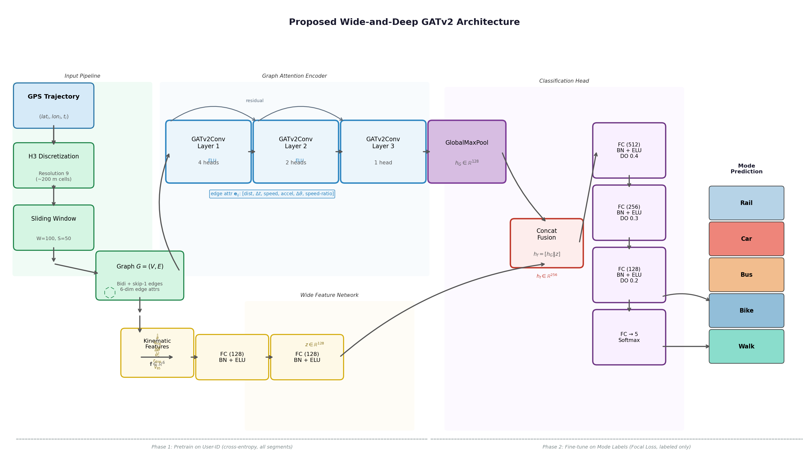
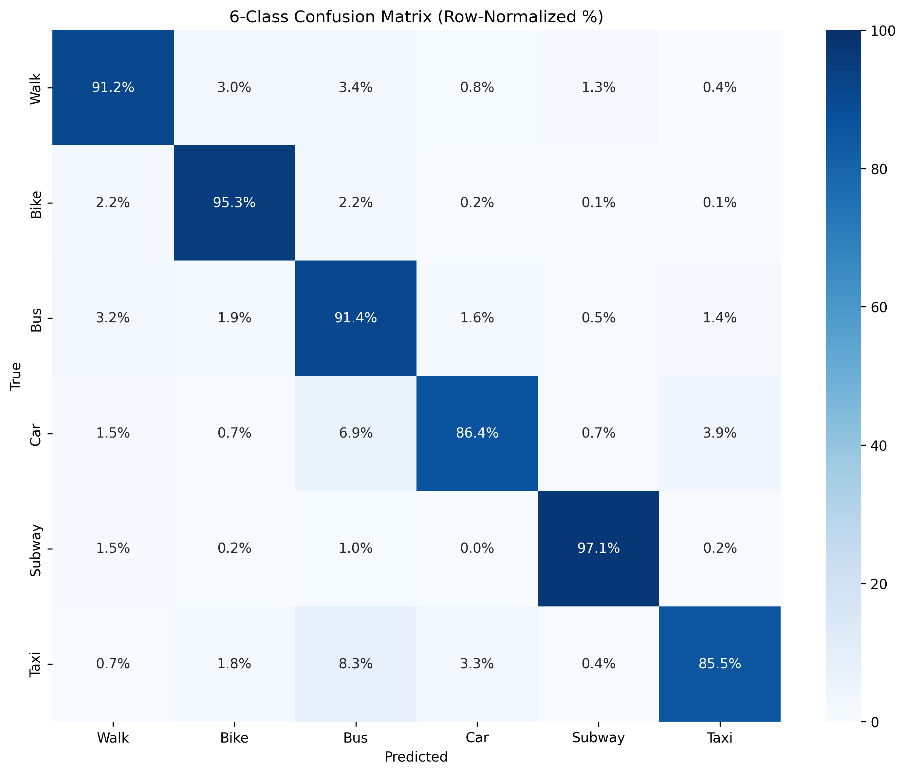
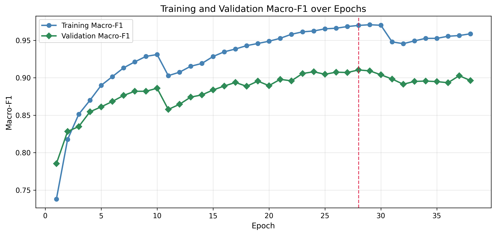
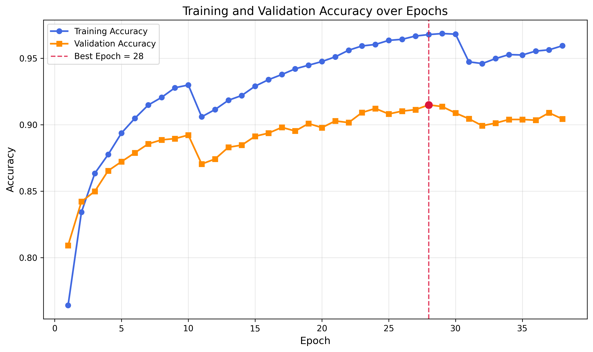
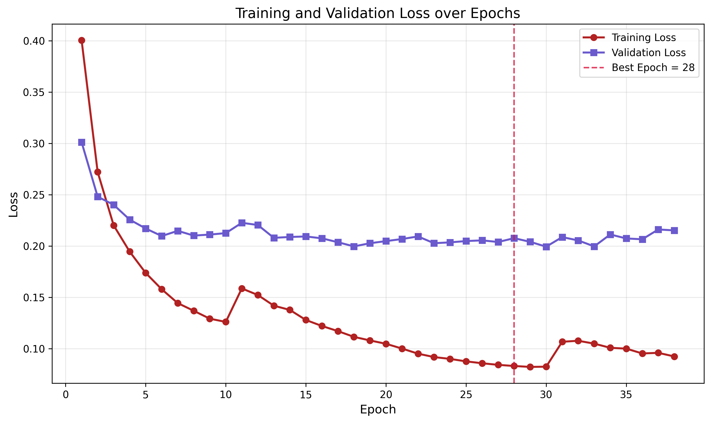

# Transportation Mode Classification from GPS Trajectories Using Graph Attention Networks

Official code for the paper published at the **27th IEEE International Conference on Mobile Data Management (MDM 2026)**.

**Authors:** Sangrez Khan, Umar Farooq, John Violos, Hanna Kavalionak, Emanuele Carlini, Aris Leivadeas
**Paper:** [doi.org/10.1109/MDM71479.2026.00083](https://doi.org/10.1109/MDM71479.2026.00083)

## Overview

We classify the transportation mode of GPS trajectory segments (**Walk, Bike, Bus, Car, Subway, Taxi**) using a hybrid *wide-and-deep* model that combines:

- **Deep branch:** a Graph Attention Network (4 × GATv2Conv) that learns spatial embeddings from trajectory graphs built on the Uber [H3](https://github.com/uber/h3) hexagonal grid.
- **Wide branch:** a small MLP over 12 handcrafted kinematic and temporal features.
- **Two-stage transfer learning:** the model is first pretrained on *user identification*, which uses every segment, labelled or not. It is then fine-tuned for transportation mode classification with a class-weighted Focal Loss.

On GeoLife the model reaches **91.27 % accuracy** and **91.59 % macro F1**. That beats Random Forest, LSTM and CNN baselines, and a standard GNN by more than 5.2 F1 points.



## Method

**Graph construction.** Each GPS point is mapped to an H3 cell at resolution 9 (about 0.105 km² per cell, about 200 m edge length). Trajectories are cut into sliding windows (W = 100 points, stride S = 50). Each window becomes a graph whose nodes are H3 cells. It has three kinds of directed edges:

1. sequential forward edges
2. sequential backward edges, for bidirectional message passing
3. skip-ahead edges (i → i+2), to widen the receptive field

Every edge carries a 6-d attribute vector: cumulative distance, elapsed time, average speed, acceleration, heading change and speed ratio.

**Wide features (12-d, all scaled to [0, 1]):**

- log-scaled 85th-percentile speed
- stop ratio (< 1 m/s)
- log speed variance
- mean heading-change rate
- straightness ratio
- log mean absolute acceleration
- sin/cos of the hour of day
- sin/cos of the day of week
- brief-stop rate (30–120 s stops, a taxi pickup signature)
- velocity entropy

**Encoder.** Four GATv2Conv layers (4, 4, 2 and 1 heads) with ELU activation, dropout and residual connections. The graph embedding is soft-attention pooling plus global max pooling. It is concatenated with the wide-branch output, then passed to a linear softmax classifier.

**Training.**

- *Phase 1 (pretraining):* user-ID prediction with cross-entropy on all segments.
- *Phase 2 (fine-tuning):* labelled segments only, with class-weighted Focal Loss (γ = 2.5, label smoothing 0.1) and early stopping on validation macro F1.
- Both phases use AdamW, cosine LR schedules and gradient clipping at 1.0.
- The data is split 80 / 10 / 10, stratified.

### Hyperparameters

| Parameter | Value |
|---|---|
| Node embedding dimension | 256 |
| GATv2Conv blocks | 4 |
| Wide branch input size | 12 |
| Batch size | 64 |
| Pretraining: epochs / LR / weight decay | 20 / 1e-3 / 1e-4 |
| Pretraining LR schedule | Cosine annealing with warmup |
| Fine-tuning: LR / loss | 5e-4 / class-weighted Focal Loss |
| Focal γ / label smoothing | 2.5 / 0.1 |
| Fine-tuning LR schedule | Cosine warm restarts (T₀ = 10) |
| Early-stopping patience | 10 |

## Results (GeoLife, held-out test set)

| Method | Accuracy | Precision | Recall | F1 |
|---|---|---|---|---|
| Random Forest | 0.8189 | 0.8386 | 0.7601 | 0.7886 |
| LSTM | 0.7026 | 0.6454 | 0.6618 | 0.6496 |
| CNN | 0.7182 | 0.6585 | 0.7145 | 0.6735 |
| GNN | 0.8660 | 0.8610 | 0.8682 | 0.8630 |
| **Proposed** | **0.9127** | **0.9114** | **0.9200** | **0.9159** |

Per-class results of the proposed model:

| Mode | Precision | Recall | F1 |
|---|---|---|---|
| Walk | 0.92 | 0.91 | 0.91 |
| Bike | 0.93 | 0.95 | 0.94 |
| Bus | 0.92 | 0.91 | 0.92 |
| Car | 0.90 | 0.92 | 0.91 |
| Subway | 0.93 | 0.96 | 0.95 |
| Taxi | 0.84 | 0.85 | 0.84 |

| Confusion matrix (%) | Validation macro F1 |
|---|---|
|  |  |
| **Training / validation accuracy** | **Training / validation loss** |
|  |  |

## Repository structure

```
├── train_gat.py         # Preprocessing, graph construction, two-phase training, evaluation and plots
├── baselines.py         # Random Forest / LSTM / CNN / GNN (GraphSAGE) baselines
├── generate_figure.py   # Draws the architecture figure
├── figures/             # Result plots and the architecture diagram
└── requirements.txt
```

## Getting started

### 1. Install

```bash
pip install -r requirements.txt
```

Install PyTorch and PyTorch Geometric to match your CUDA version. See the [PyG installation guide](https://pytorch-geometric.readthedocs.io/en/latest/install/installation.html).

### 2. Get the data

Download [GeoLife GPS Trajectories v1.3](https://www.microsoft.com/en-us/download/details.aspx?id=52367) from Microsoft Research. Extract it so the user folders sit at `./Geolife/data/000`, `./Geolife/data/001` and so on, or change `DATASET_ROOT` in `train_gat.py`.

Only points inside the Beijing bounding box (lat 39.75–40.10, lon 116.15–116.60) are used.

### 3. Train and evaluate

```bash
python train_gat.py
```

The first run processes GeoLife into per-segment graphs under `./geolife_processed_7class_v2/`. It then pretrains, fine-tunes and evaluates the model. The outputs are:

- the best checkpoint (`best_model_6class_v2.pth`)
- the final model (`production_model_6class_v2.pth`)
- the result plots, as PNG, SVG and PDF

### 4. Baselines

```bash
python baselines.py --processed-dir ./geolife_processed_7class_v2
```

This reuses the processed graphs from step 3 and writes a CSV of metrics for each baseline.

## Citation

```bibtex
@inproceedings{khan2026transportation,
  title     = {Transportation Mode Classification from GPS Trajectories Using Graph Attention Networks},
  author    = {Khan, Sangrez and Farooq, Umar and Violos, John and Kavalionak, Hanna and Carlini, Emanuele and Leivadeas, Aris},
  booktitle = {2026 27th IEEE International Conference on Mobile Data Management (MDM)},
  pages     = {501--506},
  year      = {2026},
  doi       = {10.1109/MDM71479.2026.00083}
}
```

## Acknowledgment

This work is part of the **MUlti-Sensor Inferred Trajectories (MUSIT)** project. MUSIT has received funding from the European Union's HORIZON-MSCA-2023-SE-01 research and innovation programme under grant agreement No 101182585.

## License

Released under the [MIT License](LICENSE).
